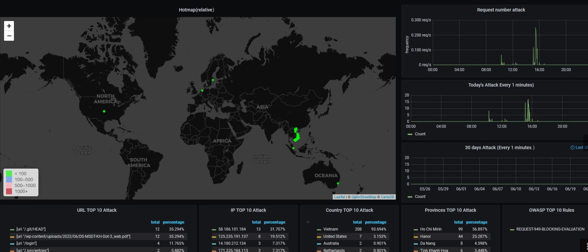
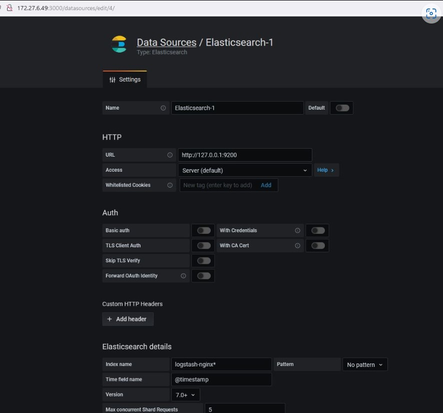
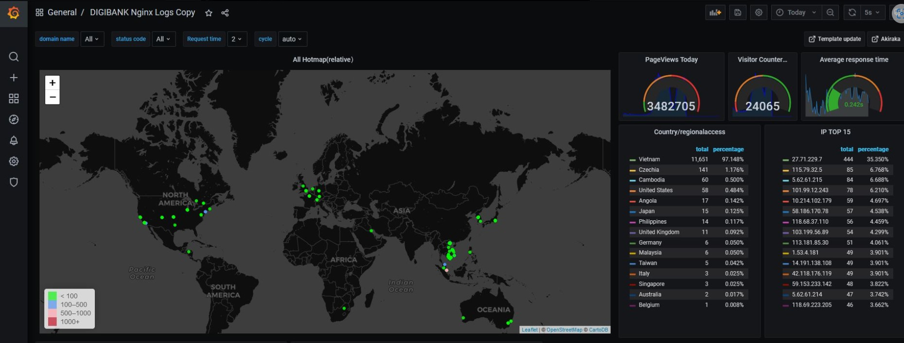

# Nginx_ModSecurity_OWASP_Filebeat

Nginx ModSecurity OWASP Filebeat Redis Logstash GeoIP Elasticserch and Grafana docker/Kubernetes



## Setup
#### In the docker-compose file this is already configured, if you want to install it on a server or computer follow the step below 

#### RedHat 7

### 1. Redis


```bash
yum install redis
systemctl enable redis
systemctl start redis
openssl rand -base64 36
 gQr8qHroGX7gqj6Gf+AsFSaHhbjN2AJCKak3k34HX4l0/kR5
```
```bash
vi /etc/redis/redis.conf
```
```bash

bind 0.0.0.0
port 6379
daemonize yes
supervised systemd
requirepass gQr8qHroGX7gqj6Gf+AsFSaHhbjN2AJCKak3k34HX4l0/kR5
```
### 2.Filebeat

```bash
wget https://artifacts.elastic.co/downloads/beats/filebeat/filebeat-6.8.23-x86_64.rpm

systemctl enable filebeat
systemctl start filebeat
```
```bash
vi /etc/filebeat/filebeat.yml
```

```bash

filebeat.inputs:
- type: log
  enabled: true
  paths:
    - /var/log/nginx/filebeat.vietcapitalbank.com.vn.error.log
  json.keys_under_root: true
  json.overwrite_keys: true
  json.add_error_key: true

filebeat.config.modules:
  path: ${path.config}/modules.d/\*.yml
  reload.enabled: false

setup.template.settings:
  index.number_of_shards: 3
```
```bash
systemctl start filebeat
```

### 3.Logstash

```bash
yum install logstash
```
```bash
vi /etc/logstash/conf.d/owasp.conf
```
```bash
  input {
  redis {
    data_type =>"list"
    key =>"owasp_logs"
    host =>"127.0.0.1"
    port => 6379
    password => "gQr8qHroGX7gqj6Gf+AsFSaHhbjN2AJCKak3k34HX4l0/kR5"
    db => 0
  }
}
filter {
   grok {
       match => { "message" => "(?<timestamp>%{YEAR}[./]%{MONTHNUM}[./]%{MONTHDAY} %{TIME}) \[%{LOGLEVEL:severity}\] %{POSINT:pid}#%{NUMBER:threadid}\: \*%{NUMBER:connectionid} %{GREEDYDATA:attack}, client: %{IP:client}, server: %{GREEDYDATA:server}"}
       remove_field => ["message"]
 }
   grok {
       match => {"attack" => "(?<attack_file>\[file \".+\/(.*?).conf\"\])"}
 }
 grok {
       match => {"attack_file" => "(?<attack_name>[A-Z][^.]+)"}
       remove_field => ["attack_file"]
 }
   grok {
       match => {"attack" => "(?<attack_message>\[msg \"(.*?)\"\])"}
   }
   grok {
       match => {"attack" => "(?<attack_data>\[data \"(.*?)\"\])"}
   }
   grok {
       match => {"attack" => "(?<attack_uri>\[uri \"(.*?)\"\])"}
       remove_field => ["attack"]
   }
   grok {
       match => {"attack_uri" => "(?<attack_url>[/].+\")"}
   }
   if [message] =~ "\A\{.+\}\z" {
       json {
         source => "message"
         target => "httpRequest"
       }
       mutate {
         remove_field => [ "json", "message" ]
       }
   }
   mutate {
         remove_field => [ "json", "agent" ]
         remove_field => [ "json", "tags" ]
         remove_field => [ "json", "thread_name" ]
   }
  geoip {
    target => "geoip"
    source => "client"
    database => "/usr/share/elasticsearch/modules/ingest-geoip/GeoLite2-City.mmdb"
    add_field => [ "[geoip][coordinates]", "%{[geoip][longitude]}" ]
    add_field => [ "[geoip][coordinates]", "%{[geoip][latitude]}" ]
    remove_field => ["[geoip][latitude]", "[geoip][longitude]", "[geoip][country_code]", "[geoip][country_code2]", "[geoip][country_code3]", "[geoip][timezone]", "[geoip][continent_code]", "[geoip][region_code]"]
  }
}
output {
  elasticsearch {
    hosts => ["127.0.0.1"]
    #user => "myusername"
    #password => "mypassword"
    index => "logstash-nginx-owasp_logs-%{+YYYY.MM.dd}"
  }
}
```

#### Download GeoLite2-City.mmdb from https://github.com/P3TERX/GeoLite.mmdb

```bash
systemctl restart logstash
```

### 4.Elasticsearch

```bash
yum install elasticsearch
systemctl enable elasticsearch
systemctl start elasticsearch
```

### 5. Grafana

```bash
yum install grafana
systemctl restart grafana-server
```
Access http://IP:3000/?orgId=1 to config datasource
Import dashboard from https://grafana.com/grafana/dashboards/16485




# Other config Nginx Access Logs to Grafana



Config NGINX access logs

Add the following code under the HTTP {} section as follows:


### 1. Nginx Logformat

```bash
vi /etc/nginx/nginx.conf
```

```bash
log_format grafana_logs
    '{"@timestamp":"$time_iso8601",'
    '"host":"$hostname",'
    '"server_ip":"$server_addr",'
    '"client_ip":"$remote_addr",'
    '"xff":"$http_x_forwarded_for",'
    '"domain":"$host",'
    '"url":"$uri",'
    '"referer":"$http_referer",'
    '"args":"$args",'
    '"upstreamtime":"$upstream_response_time",'
    '"responsetime":"$request_time",'
    '"request_method":"$request_method",'
    '"status":"$status",'
    '"size":"$body_bytes_sent",'
    '"request_body":"$request_body",'
    '"request_length":"$request_length",'
    '"protocol":"$server_protocol",'
    '"upstreamhost":"$upstream_addr",'
    '"file_dir":"$request_filename",'
    '"http_user_agent":"$http_user_agent"'
  '}';
```
 ```bash
vi  /etc/nginx/conf.d/web.conf
```
 ```bash
 access_log /var/log/nginx/filebeat.vietcapitalbank.com.vn.access.log grafana_logs;
```
 ```bash
 nginx -t
 nginx -s reload
```
## Referência
Thanks 
 - [Nguyenchihoa blogspot ](https://nguyenchihoa.blogspot.com/2022/06/)


